<div align="center">

# 📖 StudyBook

**Your whole semester in one place: notes, deadlines, flashcards and revision plans.**

Markdown notes like Obsidian, courses and deadlines like Notion, spaced repetition like Anki,
with an optional AI study assistant on top. A desktop app for Linux and Windows: single-user, no account, and your data stays on your computer.


[](https://github.com/WilliamMorgan73/StudyBook/releases/latest)

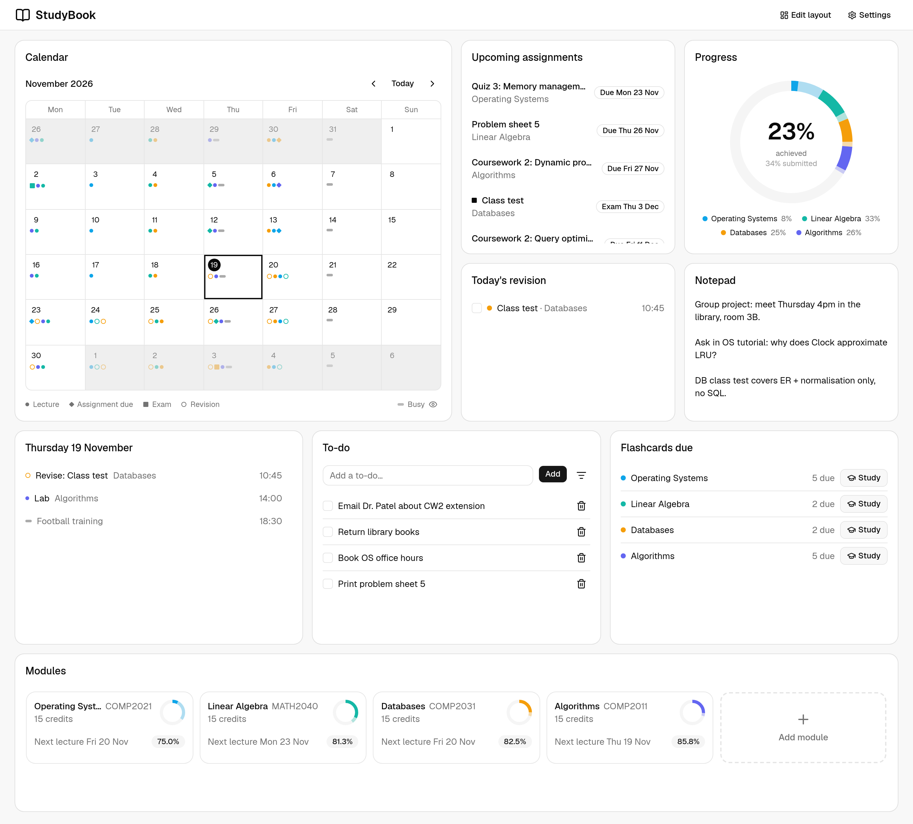

</div>

---

## ⬇️ Download

Get the latest version from the **[Releases page](https://github.com/WilliamMorgan73/StudyBook/releases)**. Nothing else needs installing: the app includes everything it runs on.

| System | File | How to install |
|---|---|---|
| **Linux** (Debian, Ubuntu, Mint…) | `StudyBook_x.y.z_amd64.deb` | Open it with your software installer, or `sudo apt install ./StudyBook_*.deb` |
| **Linux** (any distro) | `StudyBook_x.y.z_amd64.AppImage` | Make it executable (`chmod +x`) and run it |
| **Windows 10/11** | `StudyBook_x.y.z_x64-setup.exe` | Run it. The app isn't code-signed yet, so Windows may warn that it's unrecognised: choose **More info → Run anyway** |

> **v0.1.0 is a pre-release.** The Linux builds have been tested on a real machine; the Windows installer builds but hasn't been run on Windows yet. Problems are welcome as [issues](https://github.com/WilliamMorgan73/StudyBook/issues).

The first launch walks you through setup: theme, your modules, page layouts, an optional AI key and your calendars. Your data lives in your user folder (`~/.local/share/com.willmorgan.studybook` on Linux, `%APPDATA%\com.willmorgan.studybook` on Windows); Settings → Data shows exactly where.

---

## ✨ Features

### 🗓️ A dashboard you arrange yourself

The Overview is a grid of widgets that you drag, resize, add and remove:

- **Calendar** with lectures, deadlines, exams, revision sessions and your own busy time
- **Day agenda**, **upcoming assignments** and a **progress ring** that shows how much of each module's grade you've earned
- **Today's revision**, **flashcards due**, a **to-do list** and a scratch **notepad**

Module pages are arranged the same way, and you can make your own layout the default for every module.

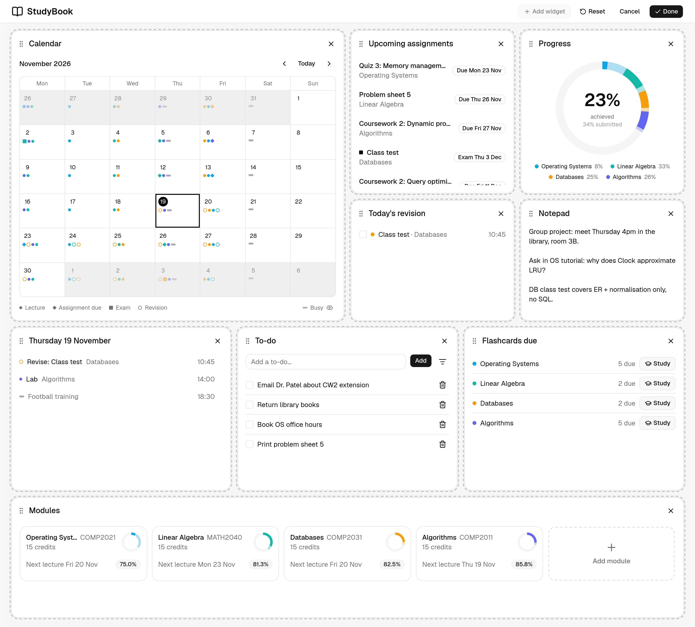

### 📚 Modules, lectures and grades

Each course gets a colour, a credit weighting, a live countdown to the next lecture and a two-week schedule. Recurring lectures (weekly or fortnightly) are entered once, and you can note which topics each lecture covered. Your **current grade** is a weighted average of everything graded so far.

**Calendar sync:** subscribe to your university timetable or Google Calendar (an iCal link or an uploaded `.ics` file). Lecture series can be linked to modules, and StudyBook suggests the match from the module code. Everything else shows as busy time that revision plans avoid. Recurring busy time of your own (work shifts, training) can be added too.

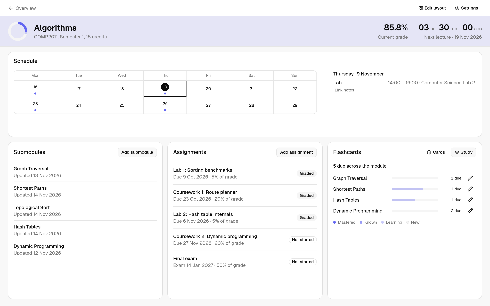

### ✅ Assignments and exams

Each assignment has a weighting (a module's weightings can't add up to more than 100%), a due-date countdown and a status that moves through *not started → submitted → graded*. Its notes fill the left of the page in the same live editor as your topic notes. On the right, a checklist tracks your progress, and attached files (the brief, a rubric, a past paper) open in a PDF, image or video preview. Exams also store a duration, a location and the topics they cover, shown as links in the header, plus their revision plan.

<table>
  <tr>
    <td>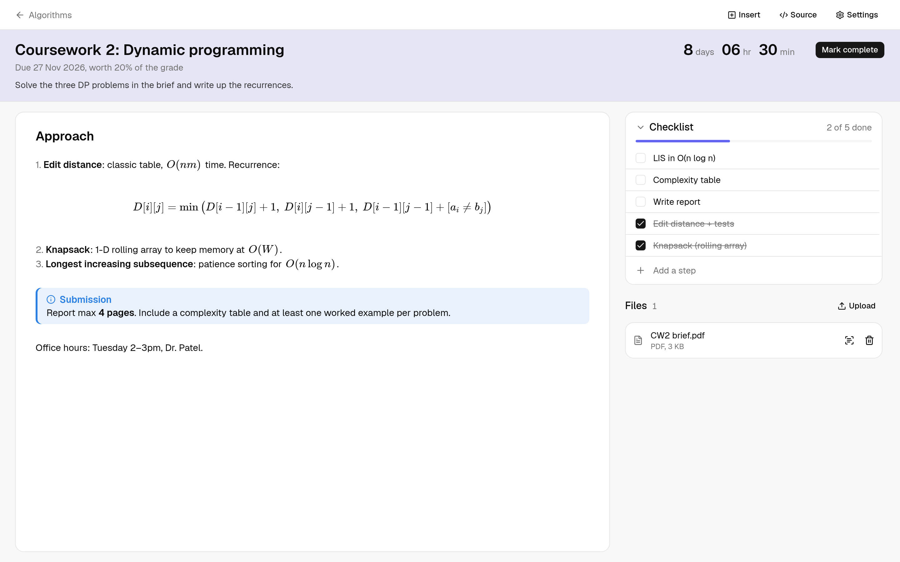</td>
    <td>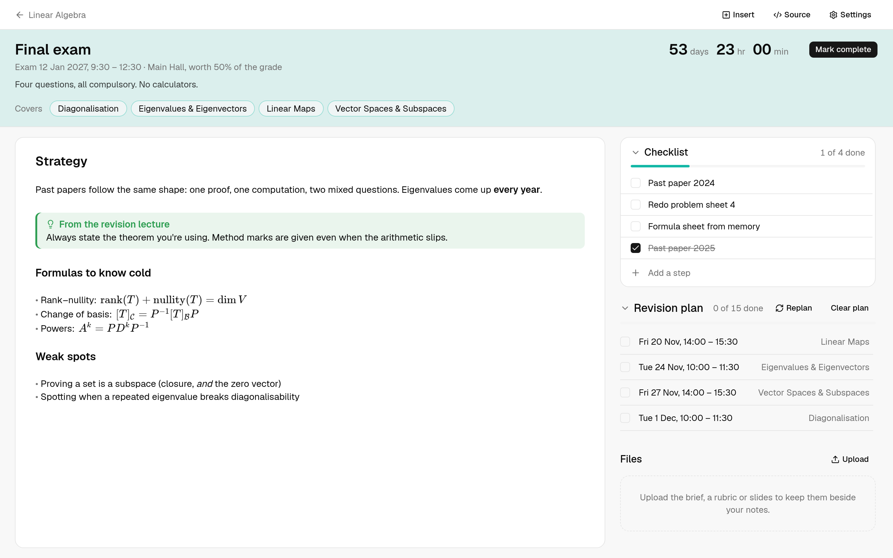</td>
  </tr>
</table>

### ✍️ Notes that render as you type

Each topic is a full-page markdown document in an Obsidian-style **live-preview editor**. Headings, tables, code blocks, images and **LaTeX maths** (KaTeX) render inline while you write.

- `[[Wikilinks]]` between topics, with Ctrl/Cmd+click to jump
- A `/` menu for headings, lists, tables, code blocks, maths, images and embeds (`/table3x4`, `/tipcallout`, `/sidebox`)
- Obsidian-style callouts (`> [!tip]`), two-column side boxes, and `![[file]]` embeds that preview PDFs, images and video inline. Paste or drop a file to upload it
- Collapsible headings and embeds, so long notes stay manageable
- Keybinds you can rebind, plus adjustable font size and table alignment

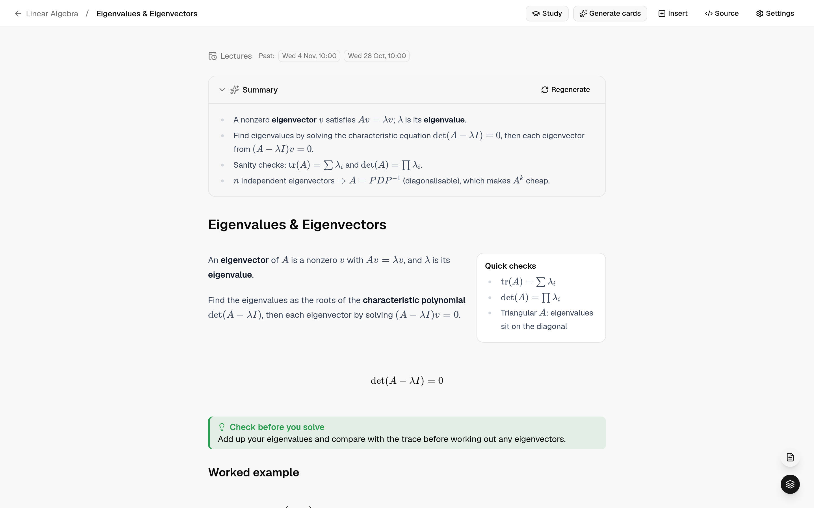

### 🧠 Spaced-repetition flashcards

Flashcards use **SM-2** scheduling (ease factor, interval, due date), the same algorithm Anki is based on. Cards support markdown and maths, can belong to a topic or a whole module, and every review is logged so StudyBook can tell which topics you're weak on. Study shows the next interval for each answer, and an Anki-style **card browser** lets you search and edit cards without losing their scheduling.

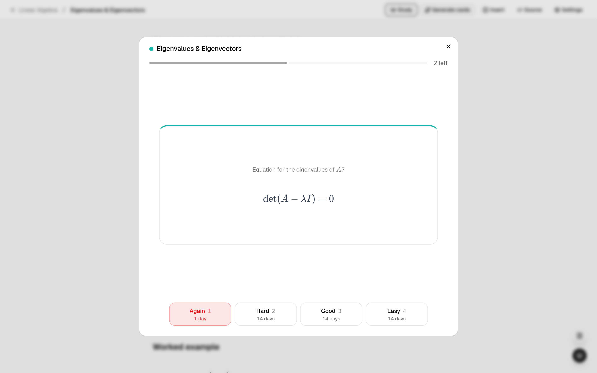

### 🎯 Revision planner

Pick an exam, the days you can study and how long each session should be. StudyBook then plans sessions in the free gaps around your lectures, other exams and busy time, and gives **more sessions to the topics you keep getting wrong**. Each session lists your weakest cards for that topic. If you miss sessions or a topic's weakness changes a lot, StudyBook suggests **replanning**, keeping the sessions you've already done.

<table>
  <tr>
    <td>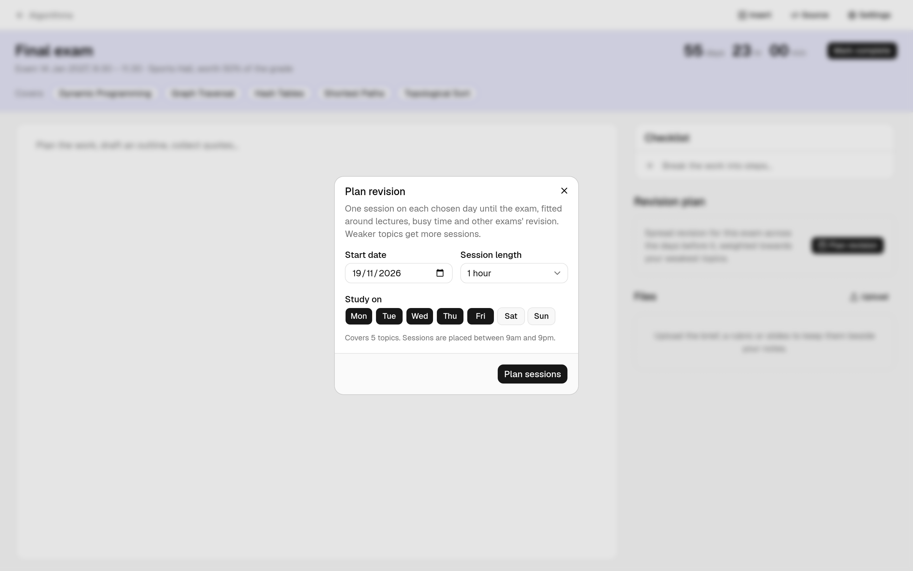</td>
    <td>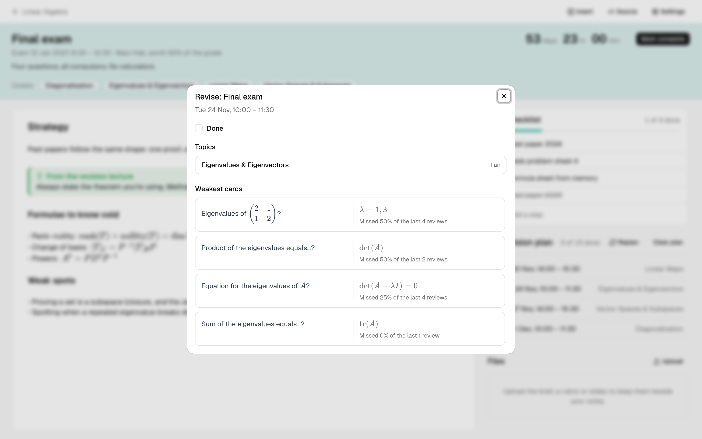</td>
  </tr>
</table>

### 🤖 AI study tools (optional, bring your own key)

Add an **Anthropic (Claude)** or **Google (Gemini)** API key in Settings to unlock:

- **Flashcard generation** from a topic's notes and lecture slides, with a review step to accept, edit or reject each card
- **Topic summaries** that show a badge when your notes have changed since the summary was written
- Lecture slides (PDF/PPTX) are converted to text locally first. Before each request you see an estimate of its size, and you can send the original PDF instead when a scanned file has no extractable text

Everything else works without a key.

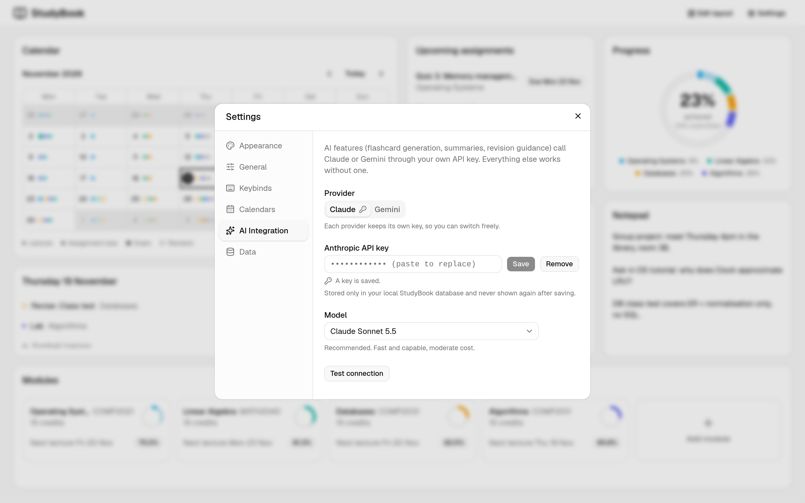

### 💾 Backups

Settings → Data downloads **one file with everything**: modules, notes, flashcards and their review history, calendars, settings and attached files (but not your AI keys). Restoring it replaces everything, and StudyBook saves a copy of what was there first. You can also restore from the first-run screen, which is the way to move to a new computer.

### 🌗 Themes

Light, dark or follow your system, with three skins (default, slate, sepia).

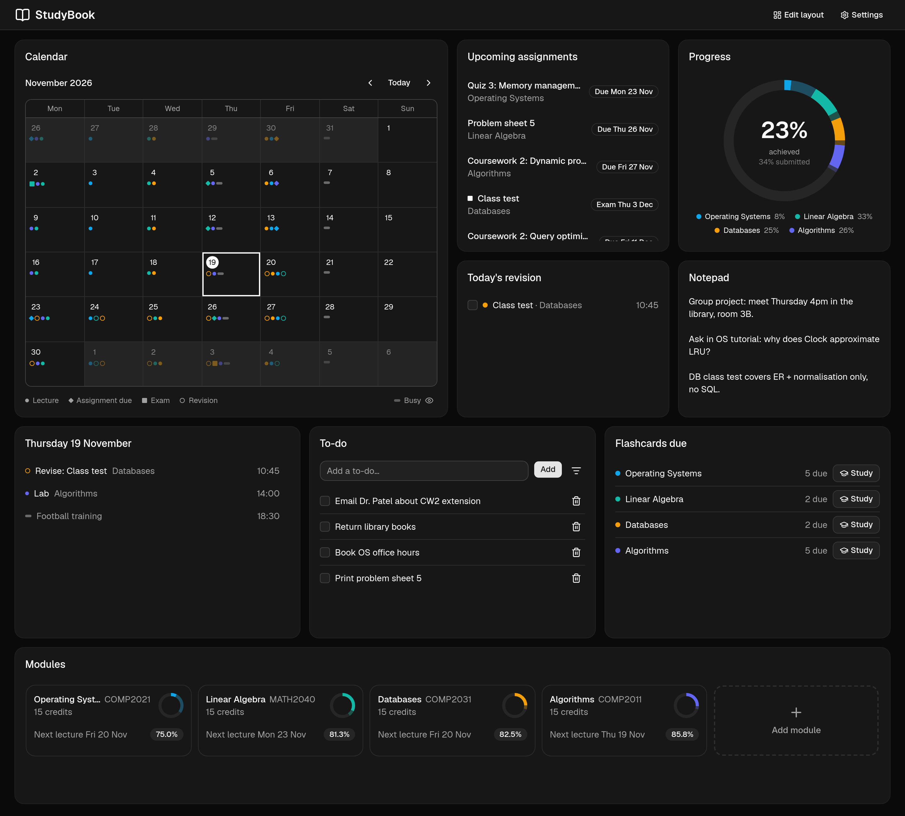

---

## 🛠️ Tech stack

| Layer | Tools |
|---|---|
| **Frontend** | React 19, TypeScript, Vite, Tailwind CSS v4, shadcn/ui (Radix), React Router, CodeMirror 6, KaTeX, Motion, react-grid-layout |
| **Backend** | Python, FastAPI, SQLAlchemy 2.0, Alembic, Pydantic, markitdown (PDF/PPTX → text) |
| **Database** | SQLite (created and migrated by the app itself) |
| **AI** | Anthropic SDK (Claude), Google GenAI SDK (Gemini) |
| **Desktop** | Tauri 2, with the backend bundled by PyInstaller |
| **Tooling** | uv, pnpm, pytest, Vitest, Ruff, oxlint, GitHub Actions |

---

## 🧑‍💻 Running from source

For development, or to run it in a browser. **Prerequisites:** [uv](https://docs.astral.sh/uv/), [pnpm](https://pnpm.io/) and Node.js.

```bash
git clone https://github.com/WilliamMorgan73/StudyBook.git
cd StudyBook

# 1. Backend (http://localhost:8000, API docs at /docs)
cd backend
uv sync
uv run uvicorn app.main:app --reload

# 2. Frontend, in a second terminal (http://localhost:5173)
cd frontend
pnpm install
pnpm dev
```

Then open **http://localhost:5173**.

No `.env` file and no database server are needed: the backend keeps everything in `backend/` (`studybook.db`, `uploads/`, `backups/`) and sets up the database itself on first start. To keep data elsewhere, set `DATA_DIR`. To change other settings, create `backend/.env` (see `backend/app/core/config.py`). For example, you can set `ANTHROPIC_API_KEY` or `GEMINI_API_KEY` there instead of entering a key in the app.

### 🖥️ Desktop app from source

With a Rust toolchain installed, run this from `frontend/`:

```bash
pnpm tauri dev
```

It opens StudyBook in a native window instead of a browser tab, still connected to the same local backend.

To build the installable app (backend bundled in, no Python or Node needed to run it):

```bash
pnpm tauri build    # needs Rust, uv and pnpm; output in src-tauri/target/release/bundle/
```

Releases are built by GitHub Actions: pushing a `vX.Y.Z` tag that matches `version` in `frontend/src-tauri/tauri.conf.json` builds the Linux and Windows installers into a draft release (`.github/workflows/release.yml`). CI runs the tests and linters on every pull request.

### 🧪 Tests and linting

```bash
cd backend  && uv run pytest && uv run ruff check .
cd frontend && pnpm test && pnpm lint
```

---

## 🗺️ Roadmap

Planned next (see the [open issues](https://github.com/WilliamMorgan73/StudyBook/issues)):

- AI guidance for each revision session ([#13](https://github.com/WilliamMorgan73/StudyBook/issues/13))
- Flashcards: tags and studying a chosen set ([#61](https://github.com/WilliamMorgan73/StudyBook/issues/61)), cloze/reversed/image cards ([#64](https://github.com/WilliamMorgan73/StudyBook/issues/64)), importing from Anki ([#65](https://github.com/WilliamMorgan73/StudyBook/issues/65))
- Exporting notes as Markdown files and flashcards as CSV ([#70](https://github.com/WilliamMorgan73/StudyBook/issues/70))
- An editable assignment page layout ([#63](https://github.com/WilliamMorgan73/StudyBook/issues/63)), and swapping tiles by dragging ([#75](https://github.com/WilliamMorgan73/StudyBook/issues/75))

See [`docs/ai-integration-plan.md`](docs/ai-integration-plan.md) for the AI design. Architecture notes for contributors are in [`docs/agents/`](docs/agents/).
